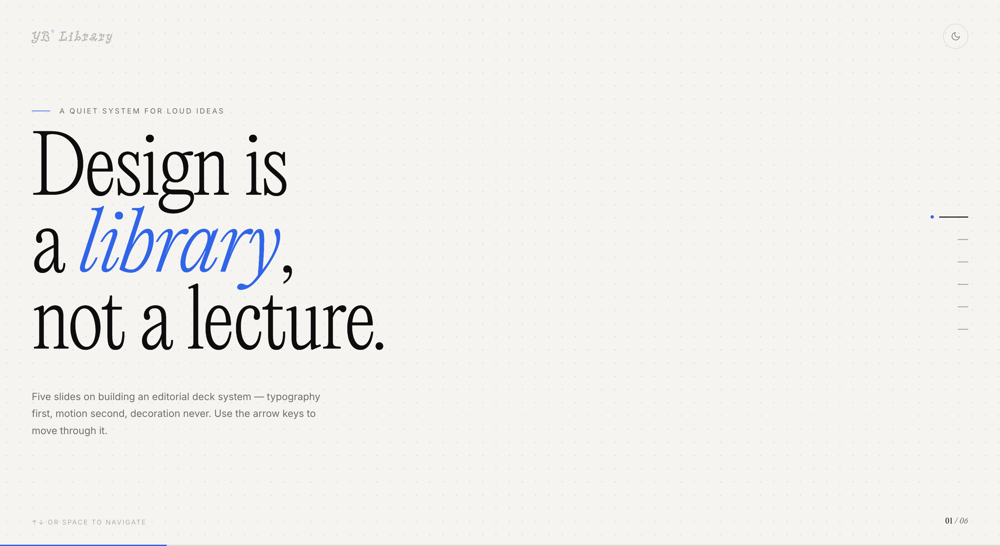
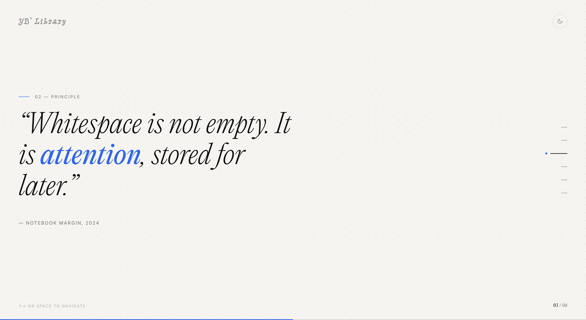
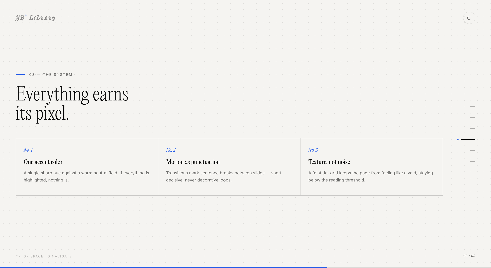
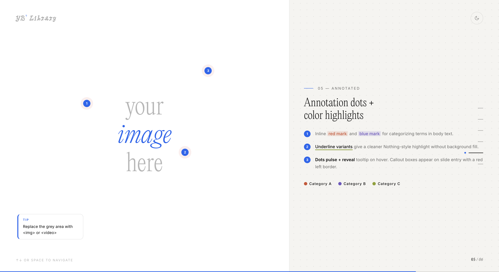

# yb-slide

> A Claude Code skill that turns a plain outline into a polished editorial HTML presentation — Nothing-inspired design, single file, no build step.



---

## Features

- **14 slide types** — cover, chapter, statement, bullet, grid, split, comparison, timeline, stats, table, fullbleed, specimen, annotated, closing
- **Dark / light mode** — toggle in-browser, both modes are first-class
- **Dot-matrix background** — Nothing-style radial dot texture on every slide
- **Editorial typography** — PPEditorialNew Ultralight display, Inter body, PicNic dot-matrix logo
- **Chinese support** — PingFang SC / TC in all font stacks, no extra setup on macOS / iOS
- **Blue accent `#1666F0`** — applied to logo tick, kicker bar, nav dot, `<em>` in headlines
- **Pudding-style color marks** — inline highlighted text in orange / purple / yellow-green with rounded pill
- **Annotation dots** — numbered, pulsing, hover tooltip with rounded bubble
- **Callout boxes** — slide-entry animated, left accent border, rounded corners
- **Nav hover preview** — rounded bubble previewing slide title on hover
- **Asset management** — images and video via relative `assets/` path, no base64 bloat
- **Keyboard navigation** — `↑ ↓` / `Space` / click half-screen to advance

---

## Screenshots

| Cover | Statement |
|---|---|
|  |  |

| Grid | Annotated |
|---|---|
|  |  |

---

## Installation

### Claude Code — Mac / Linux

```bash
git clone https://github.com/yuebinzhang77-hub/yb-slide-skill.git \
  ~/.claude/skills/yb-slide
```

### Claude Code — Windows

```powershell
git clone https://github.com/yuebinzhang77-hub/yb-slide-skill.git `
  "$env:USERPROFILE\.claude\skills\yb-slide"
```

### Codex / other Claude Code platforms

Clone into the platform's user skills directory (usually `~/.claude/skills/`). No npm install, no build step, no dependencies.

---

## Usage

Once installed, trigger the skill in any Claude Code session:

```
/yb-slide 帮我做一个关于设计系统的PPT，大纲如下：
1. 什么是设计系统
2. Token 体系
3. 组件规范
4. 落地方法论
```

Also triggered automatically when you say `帮我做PPT`, `帮我做幻灯片`, `生成slides`, or any request to turn an outline into a presentation.

Claude maps your outline to slide types, writes the content, and outputs a complete `index.html` (plus an `assets/` folder if you have images or video).

---

## Slide Types

| Class | Name | Best for |
|---|---|---|
| `.s-cover` | Cover | Opening slide — large display headline + subtitle |
| `.s-chapter` | Chapter | Section divider between topics |
| `.s-statement` | Statement | Single bold claim, pull quote, or manifesto line |
| `.s-bullet` | Bullet | 3–5 key points with body text |
| `.s-grid` | Grid | 2–4 concept cards in a hairline grid |
| `.s-split` | Split | Two-column text layout |
| `.s-comparison` | Comparison | Before / After or A vs B |
| `.s-timeline` | Timeline | Chronological sequence of events |
| `.s-stats` | Stats | 2–3 large numbers with supporting context |
| `.s-table` | Table | Feature matrix, structured comparison rows |
| `.s-fullbleed` | Fullbleed | Full-viewport image with overlay text |
| `.s-specimen` | Specimen | Typography or font showcase |
| `.s-annotated` | Annotated | Image with numbered annotation dots + notes panel |
| `.s-closing` | Closing | Thank-you, CTA, or sign-off |

---

## Asset Management

For presentations with images or video, use a folder instead of a single file:

```
my-topic/
├── index.html        ← the generated slide
└── assets/
    ├── photo.jpg
    ├── chart.svg
    └── demo.mp4
```

Reference assets with relative paths — no CDN, no internet required after generation:

```html
<!-- Image inside an annotated panel -->


<!-- Autoplay inline video -->
<video src="assets/demo.mp4" autoplay muted loop playsinline></video>
```

---

## Interactive Components

### Color marks

```html
<mark class="c-red">orange term</mark>      <!-- #D05030 fill -->
<mark class="c-blue">purple term</mark>     <!-- #7058C0 fill -->
<mark class="c-yellow">green term</mark>    <!-- #8CA028 fill -->
<mark class="u-red">underline only</mark>   <!-- orange underline, no fill -->
```

### Annotation dots (on images)

```html
<div class="anno-canvas">
  
  <div class="anno-dot" style="left:30%;top:45%">1
    <div class="anno-tip">Observation text here.</div>
  </div>
</div>
```

### Callout box

```html
<div class="callout" style="left:55%;bottom:20%">
  <div class="callout-label">Note</div>
  Appears on slide entry with a reveal animation.
</div>
```

---

## Design Tokens

| Token | Value | Usage |
|---|---|---|
| `--accent` | `#1666F0` | Logo tick, kicker bar, nav dot, `<em>` in h1 |
| `--bg` dark | `#0d0d0d` | Slide background |
| `--bg` light | `#f5f4f0` | Slide background |
| `--surface` dark | `#1c1c1c` | Tooltip / callout / nav preview fill |
| `--fg-dim` | `rgba(255,255,255,0.55)` | Body text |
| `--line` | `rgba(255,255,255,0.08)` | Hairline borders |
| Mark orange | `#D05030` | `mark.c-red` |
| Mark purple | `#7058C0` | `mark.c-blue` |
| Mark yellow-green | `#8CA028` | `mark.c-yellow` |

---

## Fonts

| Font | Role | Source |
|---|---|---|
| **PPEditorialNew Ultralight** | Display headlines | Commercial — [Pangram Pangram](https://pangrampangram.com/products/editorial-new) |
| **PicNic** | Logo dot-matrix mark | Bundled with yb-library |
| **Inter** | Body text, labels, kickers | Google Fonts (loaded automatically) |
| **PingFang SC / TC** | Chinese text fallback | macOS / iOS system font — no install needed |

### Font path

The template looks for PPEditorialNew at a relative path from the slide file to a local `yb-library` install:

```
../../../../yb-library/public/fonts/editorial-new-font-family/
```

Update the `@font-face` `src` paths in `references/template.html` to match your setup. Without PPEditorialNew, the slide gracefully degrades to `PingFang SC → Georgia`.

---

## Repository Structure

```
yb-slide-skill/
├── SKILL.md                    ← Claude Code skill definition + all HTML patterns
├── README.md                   ← this file
├── screenshots/                ← preview images used in this README
│   ├── cover.png
│   ├── statement.png
│   ├── grid.png
│   └── annotated.png
└── references/
    ├── template.html           ← full working template with 6 demo slides
    └── design-rules.md         ← typography, color, spacing, and motion rules
```

---

## Workflow

```
Your outline
     ↓
Claude Code reads SKILL.md + references/template.html
     ↓
Maps sections → slide types → writes HTML content
     ↓
Outputs  topic/index.html  +  topic/assets/
     ↓
Open in any browser — keyboard to navigate, ◑ to toggle dark / light
```

From there: drop images into `assets/`, describe any interactive effects you want, and Claude updates the slide in place.

---

## License

MIT — the template and skill definition are free to use and modify.  
PPEditorialNew requires a separate commercial license from [Pangram Pangram](https://pangrampangram.com).
